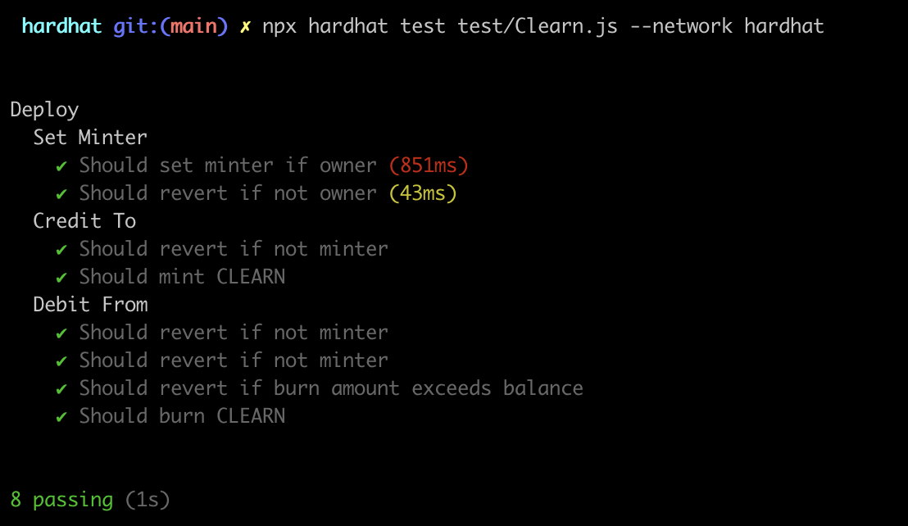
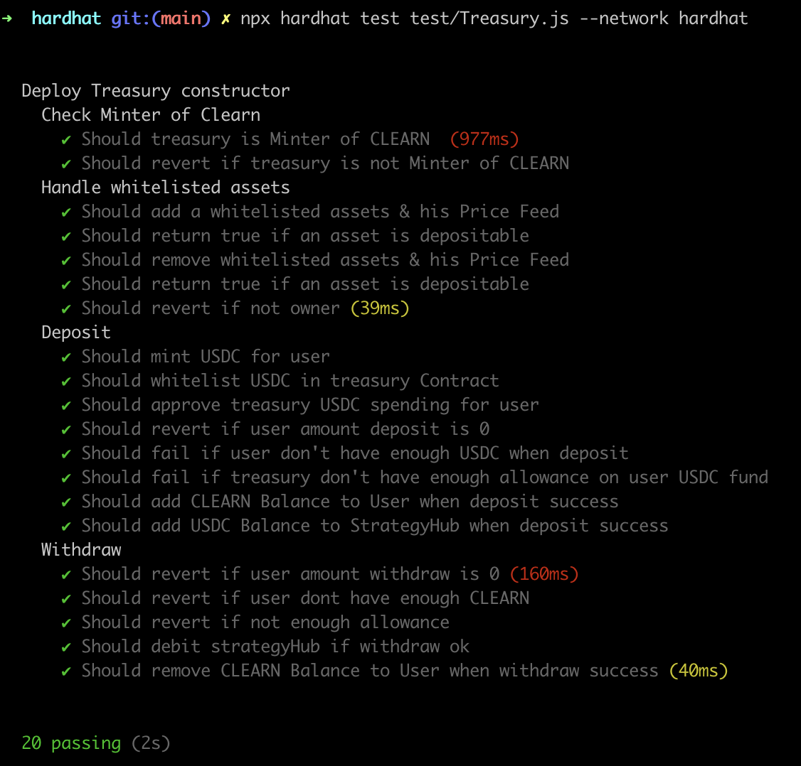
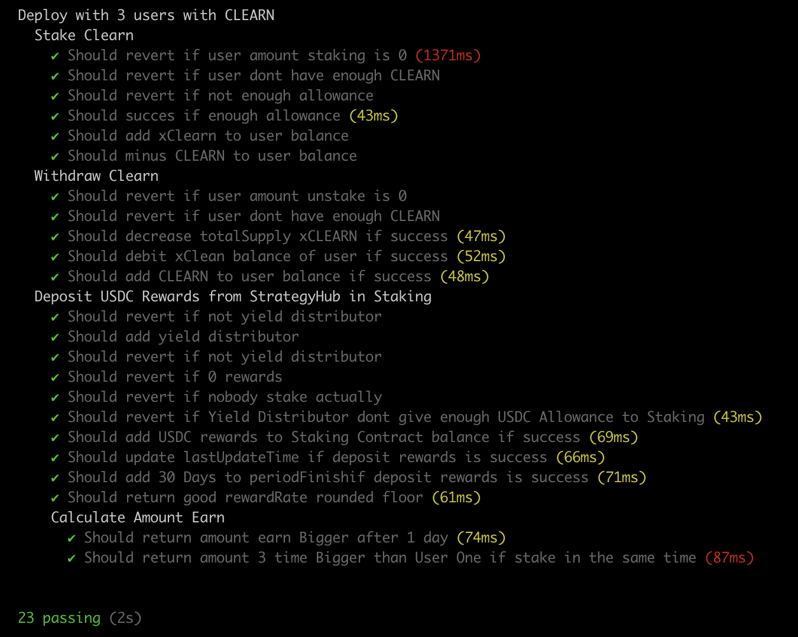

# Welcome to CLEARN

CLEARN allows users to invest funds in DEFI without having to deal with its complexity and while redistributing a portion of its returns to the association of his choice that contribute to environnement

## CONTRACTS ON GOERLI

Clearn ERC20: <a href='https://goerli.etherscan.io/address/0xeB13E623606B617d49bA8070DbC941628fBbf2dC'>0xeB13E623606B617d49bA8070DbC941628fBbf2dC</a>
Treasury : <a href='https://goerli.etherscan.io/address/0x5e2155262e03A02f06a4Ed4606a4c39E7e905e7A'>0x5e2155262e03A02f06a4Ed4606a4c39E7e905e7A</a>
Staking : <a href='https://goerli.etherscan.io/address/0x68068CDe5a5922d76C911cf32B5642Ea99339506'>0x68068CDe5a5922d76C911cf32B5642Ea99339506</a>

## DEMO WEBSITE

Test the dapp here: <a href='https://clearn-phi.vercel.app/'>https://clearn-phi.vercel.app/</a>

## Instalation

```sh
# Fetching sources from  Github
$ git clone git@github.com:0xJilan/CLEARN.git
```

```sh
# Install NextJS dependencies
$ cd client
$ npm install
```

```sh
# Install Hardhat dependencies
$ cd hardhat
$ npm install
```

## Launch local blockchain for dev

```sh
# Run Ganache
$ ganache
```

```sh
# Run CLEARN ERC20 test  :
$ cd hardhat
$ npx hardhat test test/Clearn.js --network hardhat
```



```sh
# Run Treasury test  :
$ cd hardhat
$ npx hardhat test test/Treasury.js --network hardhat
```



```sh
# Run Staking test  :
$ cd hardhat
$ npx hardhat test test/Staking.js --network hardhat
```



```sh
# Run front :
$ cd client
$ npm run dev
  Starting the development server ...
```

Dapp should be running on <a href='http/localhost:3000/'>http/localhost:3000/</a>
